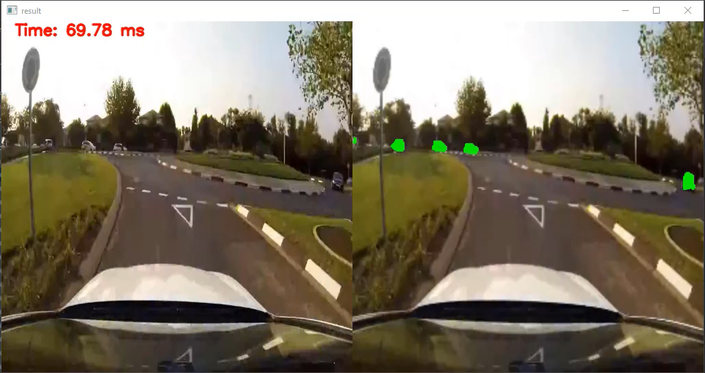
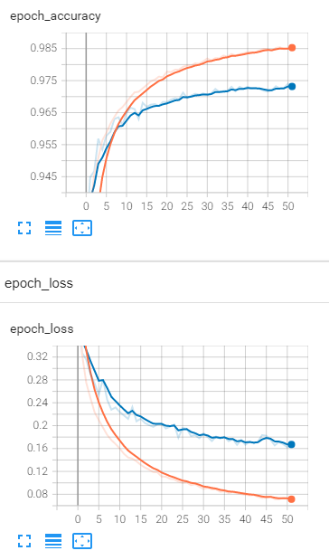

Car Detector
---
[](https://drive.google.com/file/d/1RPOzk2VjcffHYlwy9Zylf3gU4elyqmmC/view?usp=sharing)

A tiny version of original U-Net architecture was used to detect vehicles with segmentation

**vehicle classes:** car, trailer, bus, rider, motorcycle, truck. 


Requirements
---
* Python 3.8
* tensorflow 2.5
* Pillow 9.1
* opencv-python 4.5

Data Preparation
---
Dataset: [BDD100K](https://www.bdd100k.com/) (Only validation data was used for training)

Mask Creation: [mask_creator_bdd100k.py](mask_creator_bdd100k.py)

Training
---
```
from unet import CustomUnet
unet = CustomUnet()
unet.train()
```
Results:
[Pretrained model weights](https://drive.google.com/file/d/1KGsRGjwUnn5_3Zq5jIoA8QdOsVRK5Fkc/view?usp=sharing)

[]

Testing
---
```
cap = cv2.VideoCapture('video.mp4') # from video
cap = cv2.VideoCapture(0) # from camera

while cap.isOpened():
    ret, img = cap.read()
    if ret:
        start = time.time()
        res = unet.predict(img)
        txt = f'Time: {(time.time() - start) * 1000:.2f} ms'
        result_img = cv2.hconcat([img, res[1]])
        # if len(res) > 0:
        result_img = cv2.resize(result_img, (1024, 512))
        result_img = cv2.putText(result_img, txt, org, font, fontScale, color, thickness, cv2.LINE_AA)
        cv2.imshow(f'result', result_img)
        cv2.waitKey(1)

cv2.destroyAllWindows()
```
Possible Improvements
---
* Conditional Random Fields can be applied to improve results.
  - https://viesure.io/improving-performance-of-image-segmentation-with-conditional-random-fields-crf/
  - https://github.com/HLearning/unet_keras
  - https://github.com/lucasb-eyer/pydensecrf


References
---
* [U-Net Keras](https://github.com/HLearning/unet_keras)
* [Semantic Loss Functions](https://github.com/shruti-jadon/Semantic-Segmentation-Loss-Functions)
